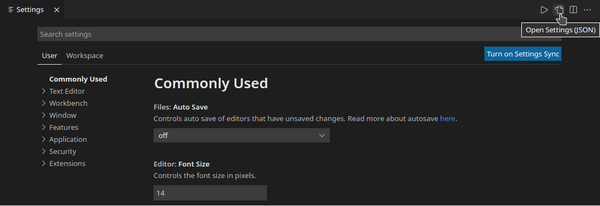

import Kbd from '../../../src/components/Kbd';
import Video from '../../../src/components/Video';

This article shows some valuable tips and tricks on how to make
[VS Code](https://code.visualstudio.com/) development experience a bit better (at least for my kind
of use cases) by enabling and editing some settings which are not set by default. You can go to your
settings and enable each one of these by either opening it up via the command palette

1. <Kbd>CMD</Kbd> + <Kbd>⌘</Kbd> + <Kbd>P</Kbd>
2. Type in _settings_
3. Select _Open Workspace Settings (JSON)_

or with the shortcut (<Kbd>CMD</Kbd> + <Kbd>,</Kbd>) and click on the icon Open Settings (JSON) on
the upper right corner.



Settings dialog in VS Code

Here are the five 🔥 things I add to improve my development environment.

## Enable bracket colorization

Using bracket colorization makes it easier to see where code blocks start and end.

<Video videoSrcURL={'/bracket-colorizer.mp4'} />

```jsx
// settings.json

// 1. enables vscode native bracket colorization
 "editor.bracketPairColorization.enabled": true
```

## Enable bracket pair guides

Besides using bracket colorization, I love to add bracket pair guides.

<Video videoSrcURL={'/bracket-pair-guides.mp4'} />

```jsx
// settings.json

// 2. enables vscode native bracket colorization
 "editor.bracketPairColorization.enabled": true
```

## Highlight modified Tab

I like to make it more clear which file I work on.

<Video videoSrcURL={'/highlight-modified-tab.mp4'} />

```jsx
// settings.json

// 3. highlight active tab
"workbench.editor.highlightModifiedTabs": true,
```

## Using Font Ligatures

It makes it easier to distinguish comparisons between code lines.

<Video videoSrcURL={'/font-ligatures.mp4'} />

```jsx
// settings.json

// use a font with font ligatures
"editor.fontFamily": "Jetbrains Mono, Menlo, Monaco, 'Courier New', monospace",
// 4. enable font ligature
"editor.fontLigatures": true,
```

## Enabling Inlay hints

<Video videoSrcURL={'/inlay-hints.mp4'} />

It can help you see what properties need to get passed into functions. without having to hover over
the function call.

```jsx
// settings.json

// 5. enable parameter hints
"typescript.inlayHints.parameterNames.enabled": "all",
```
