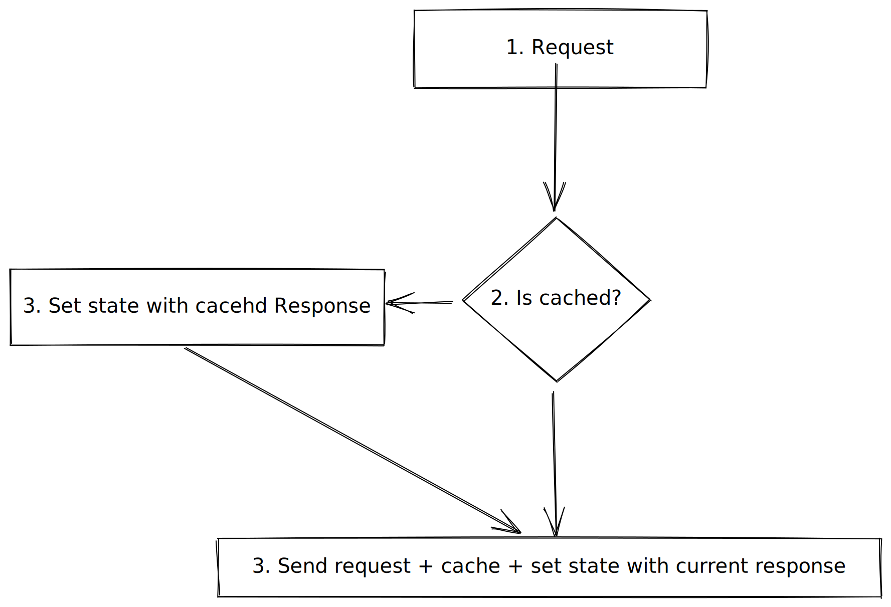
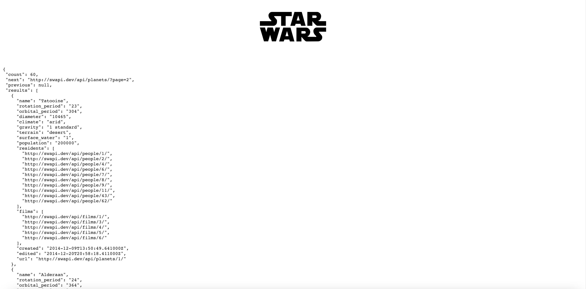

## TLDR;

- Managing server state using SWR is 🔥
- Easy integration with custom fetcher and the fetch API
- Advanced features as pagination are built in

If you want to fetch data in a modern React application there several awesome modern solutions. They help you to get focused on business logic and avoiding to manage complex server state by yourself.

In this article, I want to show how to use [SWR](https://swr.vercel.app/) to fetch data from the [Star-Wars](https://swapi.dev/) API and dive into some key 🔑 concepts and how to use SWR with TypeScript. In part 2 we gonna deep dive into some advanced features like pagination this will be the final outcome.

[https://swapi-example.vercel.app/](https://swapi-example.vercel.app/)

<iframe
  src="https://codesandbox.io/embed/github/JCofman/swapi-example/tree/main/?fontsize=14&hidenavigation=1&theme=dark"
  style="width:100%; height:500px; border:0; border-radius: 4px; overflow:hidden;"
  title="swapi-example"
  allow="accelerometer; ambient-light-sensor; camera; encrypted-media; geolocation; gyroscope; hid; microphone; midi; payment; usb; vr; xr-spatial-tracking"
  sandbox="allow-forms allow-modals allow-popups allow-presentation allow-same-origin allow-scripts"
></iframe>

## What is [SWR](https://swr.vercel.app/) and why you want to use it

SWR (stale-while-revalidate) is a library that helps you to manage your fetched data with a specific [pattern](https://tools.ietf.org/html/rfc5861) specification. It first tries to return data from the cache (stale-phase) afterward sends a request to revalidate (revalidate-phase) the data and if there is new data available it comes up with the new data. It provides you with a nice example of how to easily fetch data from different APIs like REST or GraphQL APIs. The graph shows how HTTP requests are handled by SWR.



While it also gives you several awesome features out of the box

- error retries
- polling on intervals
- request deduplication
- typescript support
- pagination recovery

and more check out their [documentation](https://swr.vercel.app/)

## Getting started installation

First, we need to create a new React-based project and install our dependencies we will use [Next.js](https://nextjs.org/) to bootstrap our application and styled-components to style our application.

1. Create a new application with a [Next.js](https://nextjs.org/) example starter

```bash
npx create-next-app --example with-typescript-eslint-jest with-typescript-eslint-jest
```

2.  Install dependencies (we will use styled-components to add styles)

```bash
npm install styled-components swr isomorphic-fetch
```

### Get something on the screen

Let's create two additional files create a `typings/typings.ts` and `utils/fetch.ts`

```bash
mkdir typings && touch typings/typings.ts
```

and

```bash
mkdir utils && touch utils/fetch.ts
```

In our `pages/index.ts` we gonna create our initial home page and fetch our first data from the [https://swapi.dev/api/planets/](https://swapi.dev/api/planets/) API.

```tsx
// pages/index.tsx
import React from 'react';
import styled from 'styled-components';
import useSWR from 'swr';

import { StarWarsPlanets } from '../types/types';
import fetch from '../utils/fetch';

const StyledStarWarsLogo = styled.img`
  height: 200px;
  pointer-events: none;
`;

const StyledHeader = styled.header`
  display: flex;
  justify-content: center;
  align-items: center;
`;

const App = () => {
  const { data, error } = useSWR<StarWarsPlanets[]>(`https://swapi.dev/api/planets/?page=${1}`, fetch);

  if (error) return <div>failed to load {JSON.stringify(error)}</div>;
  if (!data) return <div>loading...</div>;

  return (
    <div>
      <StyledHeader>
        <StyledStarWarsLogo
          height={200}
          src={'https://cdn.worldvectorlogo.com/logos/star-wars.svg'}
          alt="star-wars-logo"
        />
      </StyledHeader>
      <pre> {JSON.stringify(data, null, 2)}</pre>
    </div>
  );
};

export const Home = () => <App></App>;

export default Home;
```

As we use TypeScript we also need to create typings and a fetcher function to create calls againts our API.

To generate base types I usually go to this [awesome tool](https://transform.tools/json-to-typescript) and copy paste a JSON response (which I just copy-paste from the API call itself [https://swapi.dev/api/planets/?page=1](https://swapi.dev/api/planets/?page=1)). I then go ahead and give the types of appropriate names.

```tsx
// types/types.ts
export type StarWarsPlanet = {
  name: string;
  rotation_period: string;
  orbital_period: string;
  diameter: string;
  climate: string;
  gravity: string;
  terrain: string;
  surface_water: string;
  population: string;
  residents: string[];
  films: string[];
  created: string;
  edited: string;
  url: string;
  imageSrc?: string;
};

export interface StarWarsPlanets {
  count: number;
  next: string;
  previous: any;
  results: StarWarsPlanet[];
}
```

Finally, we will create a fetch abstraction helper which we have used in the `utils/fetch.tsx`

```tsx
// utils/fetch.tsx
import fetch from 'isomorphic-unfetch';

export default async function <JSON = any>(input: RequestInfo, init?: RequestInit): Promise<JSON> {
  const res = await fetch(input, init);
  return res.json();
}
```

if you now run

```bash
npm run dev
```

you should get to see an image of the app with the API response



## Built our component to visualize the data

As we want to display StarWars planet data we gonna create a `StarWarsPlanetCard.tsx` component inside the components folder.

```bash
mkdir components && touch components/StarWarsPlanetCard.ts
```

we then need to add Styling to our `StarWarsPlanetCard` component.

```tsx
// components/StarWarsPlanetCard.tsx
import React from 'react';
import styled from 'styled-components';
import { StarWarsPlanet } from '../types/types';
import Image from 'next/image';

const StyledCard = styled.div`
  max-width: 240px;
  height: 700px;
  background: grey;
  border-radius: 5px;
  background-size: cover;
  background-position: center center;
  box-shadow: 0px 10px 30px -5px rgba(0, 0, 0, 0.3);
  transition: box-shadow 0.5s;
  will-change: transform;
  border: 15px solid white;
  color: rgba(74, 85, 104);
  background-color: white;

  &:hover {
    box-shadow: 0px 30px 100px -10px rgba(0, 0, 0, 0.4);
  }
`;

const StyledCardWrapper = styled.div`
  padding-left: 15px;
  padding-right: 15px;
`;

const StyledCardHeader = styled.h4`
  margin-bottom: 5px;
  font-size: 18px;
  font-weight: 700;
`;

const StyledCardTags = styled.div`
  padding-top: 10px;
  padding-bottom: 5px;
  padding-left: 15px;
  padding-right: 15px;
`;

const StyledCardTag = styled.div`
  padding-left: 7.5px;
  padding-right: 7.5px;
  padding-top: 2.5px;
  padding-bottom: 2.5px;
  margin-bottom: 5px;
  margin-right: 5px;
  font-size: 12px;
  display: inline-block;
  border-radius: 9999px;
  background-color: rgba(237, 242, 247);
  color: rgba(74, 85, 104);
`;

const StyledSubHeaderParagraph = styled.p`
  font-size: 12px;
  color: rgba(113, 128, 150);
`;

const StyledDescriptionList = styled.dl``;

const StyledDescriptionWrapper = styled.div`
  display: grid;
  padding-top: 8px;
  padding-bottom: 8px;
  grid-template-columns: repeat(3, minmax(0, 1fr));
`;

const StyledDescriptionListTerm = styled.dt`
  color: rgba(107, 114, 128);
  line-height: 18px;
  font-size: 14px;
  font-weight: 500;
`;

const StyledDescriptionListDescription = styled.dd`
  grid-column: span 2 / span 2;
`;

const StarWarsPlanetCard = (props: StarWarsPlanet) => {
  const {
    name,
    diameter,
    rotation_period,
    orbital_period,
    gravity,
    population,
    climate,
    terrain,
    surface_water,
    created,
    edited,
  } = props;

  const createdFormattedDate = new Date(created).toLocaleDateString();
  const editedFormattedDate = new Date(edited).toLocaleDateString();

  return (
    <StyledCard key={`${name} planet`}>
      <StyledCardWrapper>
        <Image
          src={`/images/planet-${Math.floor(Math.random() * 9)}.jpg`}
          alt={`${name} planet`}
          height={250}
          width={250}
          objectFit="cover"
          loading="eager"
          priority
        />
        <StyledSubHeaderParagraph>
          created: <b>{createdFormattedDate}</b>
        </StyledSubHeaderParagraph>
        <StyledSubHeaderParagraph>
          last edited: <b>{editedFormattedDate}</b>
        </StyledSubHeaderParagraph>
        <StyledCardHeader>{name}</StyledCardHeader>
        <StyledDescriptionList>
          <StyledDescriptionWrapper>
            <StyledDescriptionListTerm>Diameter</StyledDescriptionListTerm>
            <StyledDescriptionListDescription>{diameter}</StyledDescriptionListDescription>
          </StyledDescriptionWrapper>
          <StyledDescriptionWrapper>
            <StyledDescriptionListTerm>Rotation Period</StyledDescriptionListTerm>
            <StyledDescriptionListDescription>{rotation_period}</StyledDescriptionListDescription>
          </StyledDescriptionWrapper>
          <StyledDescriptionWrapper>
            <StyledDescriptionListTerm>Orbital Period</StyledDescriptionListTerm>
            <StyledDescriptionListDescription>{orbital_period}</StyledDescriptionListDescription>
          </StyledDescriptionWrapper>
          <StyledDescriptionWrapper>
            <StyledDescriptionListTerm>Gravity</StyledDescriptionListTerm>
            <StyledDescriptionListDescription>{gravity}</StyledDescriptionListDescription>
          </StyledDescriptionWrapper>
          <StyledDescriptionWrapper>
            <StyledDescriptionListTerm>Population</StyledDescriptionListTerm>
            <StyledDescriptionListDescription>{population}</StyledDescriptionListDescription>
          </StyledDescriptionWrapper>
        </StyledDescriptionList>
      </StyledCardWrapper>
      <StyledCardTags>
        <StyledCardTag>{climate}</StyledCardTag>
        <StyledCardTag>{terrain}</StyledCardTag>
        <StyledCardTag>{surface_water}</StyledCardTag>
      </StyledCardTags>
    </StyledCard>
  );
};

export default StarWarsPlanetCard;
```

Notice that I also added an image to have a nice card background. I downloaded some awesome planet images from [Unsplash](https://unsplash.com/s/photos/planets) and added a random function to set the card image to one of the downloaded images.

## Finalize and wrapping up

Now let's use this component to display the fetched data.

```tsx
//pages/index.tsx

import React from 'react';
import styled from 'styled-components';
import useSWR from 'swr';

import { StarWarsPlanets } from '../types/types';
import fetch from '../utils/fetch';
import StarWarsPlanetCard from '../components/StarWarsPlanetCard';

const StyledStarWarsLogo = styled.img`
  height: 200px;
  pointer-events: none;
`;

const StyledHeader = styled.header`
  display: flex;
  justify-content: center;
  align-items: center;
`;

const App = () => {
  const { data, error } = useSWR<StarWarsPlanets>(`https://swapi.dev/api/planets/?page=${1}`, fetch);
  if (error) return <div>failed to load {JSON.stringify(error)}</div>;
  if (!data) return <div>loading...</div>;

  return (
    <div>
      <StyledHeader>
        <StyledStarWarsLogo
          height={200}
          src={'https://cdn.worldvectorlogo.com/logos/star-wars.svg'}
          alt="star-wars-logo"
        />
      </StyledHeader>
      <div
        css={`
          display: flex;
          justify-content: center;
          align-items: center;
          gap: 10px;
          flex-wrap: wrap;
        `}
      >
        {data.results.map((planetInformation) => {
          return <StarWarsPlanetCard {...planetInformation}></StarWarsPlanetCard>;
        })}
      </div>
    </div>
  );
};

export default Home;
```

The final result can be seen in this codesandbox

[https://codesandbox.io/s/swapi-tutorial-part-1-vht53](https://codesandbox.io/s/swapi-tutorial-part-1-vht53)

In the next part, we are going to use SWR to fetch data as we scroll horizontally through the application.
