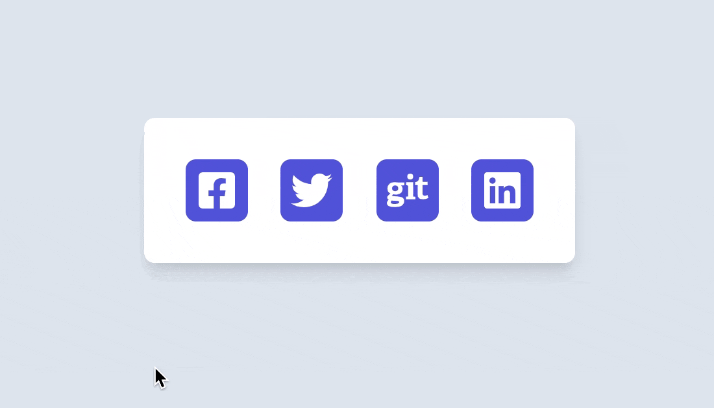
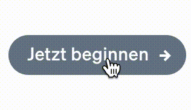

import MicroAnimations from './MicroAnimations';
import Figure from '../../../src/components/Figure';

## **TLDR;**

- Framer Motion can be used for simple and complex physics animations
- Micro animations can enhance the user experience
- They can give a web app a much more polished look

Micro animations and interactions can enhance the user experience and also make a web application
look more cleaned up and polished 💅.

There are some principles to get interactions and animations right but such details often do not get
prioritized in our fast-moving feature focused world and therefore are not well discussed. Nowadays
libraries like [Framer Motion](https://www.framer.com/motion/) make it more accessible to develop
high-quality animations without a lot of in-depth knowledge about issues like performance or
accessibility of animations. Especially more realistic motions can be described easier then ever. In
this blogpost we are going to build the following phyisics based micro animations.

<figure>
  
</figure>

### **Tiny details often can make a huge difference**

Do you prefer using a to-do app that gives you easy redo and un-do capabilities and where you see
clearly which todo items is done or on the other hand have a clunky overly complex user interface in
front of you? For example, the popular [Todoist](https://todoist.com/app/) app gives you an easily
undo mechanism and animates your completed task smoothly into the completed area.

The website [https://littlebigdetails.com/](https://littlebigdetails.com/) was an awesome place to
explore tiny details but it did not get many updates in the last few years. You can still see a lot
of older awesome examples there.

In this blog post, I want to show how to create a natural tiny micro animation that you can
implement using spring physics with Framer Motion and React. As I have mentioned a micro animation
can get a more natural look using spring physics. Down below you can see two examples from
[Stripe](https://stripe.com) and [Firebase](https://firebase.com) which use such tiny
micro-interactions in their websites.

<figure>
  
  <figcaption>
    You can see this example in action on
    <a href="https://console.firebase.google.com/">Firebase</a> (visited 2021)
  </figcaption>
</figure>
<figure>
  
  <figcaption>
    You can see this example in action on <a href="https://stripe.com">Stripe</a> (visited 2021)
  </figcaption>
</figure>

## Framer Motion

Framer Motion lets you define spring animations without complex definition and you can also easily
use the `useReduceMotion` [API](https://www.framer.com/docs/guide-accessibility/) to make animations
more accessible, since we also have to make sure to avoid (motion sickness) When we use animation a
lot and we can get Motion sickness is real.

React has a lot of really great animation community and a lot of great open source libraries like

- [React-Spring](https://react-spring.io/) and
- [Framer Motion](https://www.framer.com/motion/) are one of the most used ones libraries.
- [React Motion](https://github.com/chenglou/react-motion)
- [react-transition-group](https://github.com/reactjs/react-transition-group)

While Framer Motion is a bit bigger in the overall bundle size it is more widely used, performant
and offers a great developer experience while also making advanced animation based on spring physics
much more easy to implement.

## Natural animation

Spring animation and physics animation libraries are focused on modeling natural world forces like
gravity, friction, and fluid dynamics into animation.

it is a technique that let animation look a lot more natural. It is based on three variables

- **stiffness** (how fast the animation is)
- **damping** (how long it takes till an animation will come to an end)
- **mess**

You can read more about spring animations in an awesome
[blogpost](https://www.joshwcomeau.com/animation/a-friendly-introduction-to-spring-physics/) by Josh
W Commeau or have a look in to great
[react europe talk by](https://www.youtube.com/watch?v=1tavDv5hXpo&ab_channel=ReactEurope) by
Chenglou.

## Let's create some micro animations

We will create an example with small micro animations using framer motion. As many of the current
websites have social icons you can make them more interactive and fun using hover animations as seen
in the example below.

Try to hover over the icons to see it in action.

<div style={{ position: 'relative', marginTop: '2rem', marginBottom: '6rem' }}>
  <MicroAnimations />
</div>

[Linke to CodeSandbox](https://codesandbox.io/s/blog-micro-animation-0xfuf)

We will create four different hover animations. To get started we will create a new Create React App
and add some basic styles to it as well as social icons using the popular
[react-icons](https://react-icons.github.io/react-icons/) package.

```bash
npx create-react-app mirco-animation-example --template typescript

cd mirco-animation-example && npm install react-icons
```

Now, let's add some basic styles for our example.

```css
/* styles.css */

body {
  background: #e2e8f0;
}

.App {
  font-family: sans-serif;
  text-align: center;
  background: #e2e8f0;
}

.card {
  background: white;
  width: min-content;
  position: absolute;
  margin-left: auto;
  margin-right: auto;
  top: 30%;
  left: 0;
  right: 0;
  text-align: center;
  padding: 2rem;
  border-radius: 8px;
  box-shadow: 0 10px 15px -3px rgb(0 0 0 / 10%), 0 4px 6px -2px rgb(0 0 0 / 5%);
}

.card-social {
  display: flex;
  font-size: 2rem;
  color: lightGray;
  justify-content: center;
  align-items: center;
  gap: 1.6rem;
}

.social-icon-wrapper {
  background-color: #5c5edd;
  color: white;
  display: flex;
  border-radius: 8px;
  justify-content: center;
  align-items: center;
  width: 3rem;
  height: 3rem;
}

a {
  color: inherit;
  padding: 0;
  margin: 0;
}
```

Framer Motion provides a small API surface to integrate hover animations. You can use any basic HTML
tags `motion.div` prefixed by motion tag. This is the same API surface as
[Styled-Compoents](https://styled-components.com/docs/api) has.

You can use any HTML tag with the prefix `motion` like `motion.div`, `motion.article` or
`motion.svg` to define a new tag. In the example below we will just use the `whileHover` property of
the tag to animate the social icons. You can define what should happen to the element when a user
hovers over the div. In the case below we will rotate the icon by 9 degrees and scale it up by 1.4
and transition the color from `#5c5edd` to `#FF008C`.

```tsx
<motion.div
  whileHover={{
    rotate: 9,
    scale: 1.4,
    background: ['#5c5edd', '#FF008C'],
  }}
>
```

You can play around with different styles as you can see down below.

```tsx
import './styles.css';
import { FaFacebookSquare, FaTwitter, FaGit, FaLinkedin } from 'react-icons/fa';
import { motion } from 'framer-motion';

export default function App() {
  return (
    <div className="App">
      <main>
        <div className="card">
          <div className="card-social">
            <motion.a
              href="https://www.facebook.com/"
              target="_blank"
              rel="noopener noreferrer"
              whileHover={{
                rotate: 9,
                scale: 1.4,
                background: ['#5c5edd', '#FF008C'],
                transition: { type: 'spring' },
              }}
              className="social-icon-wrapper"
            >
              <FaFacebookSquare />
            </motion.a>
            <motion.a
              href="https://twitter.com/JCofman"
              target="_blank"
              rel="noopener noreferrer"
              whileHover={{
                rotate: -50,
                scale: 1.2,
                transition: { type: 'spring', stiffness: 900, damping: 11 },
              }}
              className="social-icon-wrapper"
            >
              <FaTwitter />
            </motion.a>
            <motion.a
              href="https://github.com/JCofman"
              target="_blank"
              rel="noopener noreferrer"
              whileHover={{
                rotate: 360,
                scale: 1.2,
                transition: { type: 'spring', stiffness: 900, damping: 20 },
              }}
              className="social-icon-wrapper"
            >
              <FaGit />
            </motion.a>
            <motion.a
              href="https://www.linkedin.com/in/jcofman/"
              target="_blank"
              rel="noopener noreferrer"
              whileHover={{
                scale: 1.1,
                transition: { type: 'spring' },
              }}
              whileTap={{
                scale: 0.9,
                transition: { type: 'spring' },
              }}
              className="social-icon-wrapper"
            >
              <FaLinkedin />
            </motion.a>
          </div>
        </div>
      </main>
    </div>
  );
}
```

As you can see above we use the [whileHover](https://www.framer.com/docs/gestures/) property to
animate our components on hover. This is the critical and magical part of the code.

We can use most of
[CSS animatble properties](https://developer.mozilla.org/en-US/docs/Web/CSS/CSS_animated_properties)
like **transform** properties

- translate
- scale
- rotate
- skew
- perspective

or

colors, scale, rotation, shadow.

Framer motion uses tween and spring animations (based on the type of the value being animated) as a
default to animate.

You can also predefine various states in Framer Motion effects using
[variants](https://www.framer.com/docs/examples/#variants) and apply the transform based on hover.

With this feature, you can also animate multiple react components with one interaction. For example,
we can create a button where an Icon gets this slick animated effect. You can create different
IconAnimation styles. I tried to replicate the one from the Firebase and Stripe example. We declare
a variant object with the initial state of "rest" and a "hover" state. We then use a motion.button
component to declare the initial state and hover state.

[https://codesandbox.io/s/blog-micro-animation-cta-buttons-loi7y](https://codesandbox.io/s/blog-micro-animation-cta-buttons-loi7y)

We also need to add some additional CSS styles.

```css
.card {
  width: min-content;
  position: absolute;
  top: 30%;
  left: -70px;
  text-align: center;
  padding: 2rem;
  border-radius: 8px;
  box-shadow: 0 10px 15px -3px rgb(0 0 0 / 10%), 0 4px 6px -2px rgb(0 0 0 / 5%);
  background: linear-gradient(-45deg, #ee7752, #e73c7e);
}

span {
  font-family: 'Inter', sans-serif;
  font-weight: 300;
}

button {
  border: none;
  display: flex;
  justify-content: center;
  align-items: baseline;
  gap: 1rem;
  width: 200px;
  font-size: 1.4rem;
  font-family: Arial, Helvetica, sans-serif;
  background: darkslategray;
  border-radius: 5rem 5rem 5rem 5rem;
  box-shadow: 0 10px 15px -3px rgb(0 0 0 / 10%), 0 4px 6px -2px rgb(0 0 0 / 5%);
  color: white;
  background: rgba(255, 255, 255, 30%);
  padding: 8px 6px;
  margin: 10px;
  line-height: 1rem;
  cursor: pointer;
}

button span {
  display: flex;
  justify-content: center;
  align-items: center;
  align-self: center;
}
```

and then we can use the `initial` property of a motion tag to define an initial state.

```tsx
const iconMotionSetting = {
  rest: {
    rotate: 0,
  },
  hover: {
    rotate: 50,
    x: 5,
    transition: { type: 'spring', stiffness: 400 },
  },
};

<motion.button initial={'rest'} whileHover="hover">
  <motion.span variants={iconMotionSetting}>
    <RiSettings3Line />
  </motion.span>
  <span> Settings </span>
</motion.button>;
```

Below is the full example with the arrow motion example.

```tsx
import './styles.css';
import { RiSettings3Line, RiArrowRightSLine } from 'react-icons/ri';
import { motion } from 'framer-motion';
import 'typeface-inter';

const iconMotionSetting = {
  rest: {
    rotate: 0,
  },
  hover: {
    rotate: 50,
    x: 5,
    transition: { type: 'spring', stiffness: 400 },
  },
};

const iconMotionArrow = {
  rest: {
    rotate: 0,
  },
  hover: {
    x: 2,
    scaleX: 1.1,
    transition: { type: 'spring', stiffness: 1000 },
  },
};

export default function App() {
  return (
    <div className="App">
      <main>
        <motion.div className="card">
          <motion.button initial={'rest'} whileHover="hover">
            <motion.span variants={iconMotionSetting}>
              <RiSettings3Line />
            </motion.span>
            <span> Settings </span>
          </motion.button>
          <motion.button initial={'rest'} whileHover="hover">
            <motion.span variants={iconMotionArrow}>
              <RiArrowRightSLine />
            </motion.span>
            <span>Register</span>
          </motion.button>
        </motion.div>
      </main>
    </div>
  );
}
```

In the next blog post, I want to show how we can use framer motion for more complex animations.
