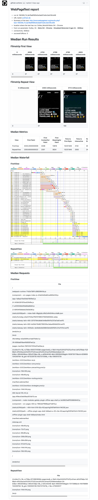
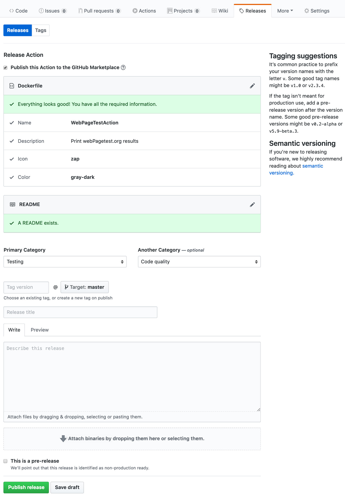

tl;dr

- Actions are still in <b>beta</b> and shouldn`t be used in production
- You may dont need any external CI / CD providers for your GitHub projects in the near future
- GitHub Actions make interacting with the GitHub API much easier
- They empower you to build new and better automation workflows
- WebPageTest is amazing! You should check it out if you want to work on web performance stuff 😁

[GitHub Actions](https://github.com/features/actions) were introduced several months ago and are still in
beta. When I first heard about GitHub Actions I immediatly compared
them with CI / CD features from GitLab. In my opinion that's exactly what they offer.
The most exciting and the only additional feature but may also be the most powerfull one is the ability to share Actions.

Before GitHub Actions were introduced you had to build automation workflows
with tools like [Travis](https://travis-ci.org/) or [CircleCI](https://circleci.com/)
but it was often not really convenient to react on different events i.e. push, issues or releases.

With Actions you can build custom workflows and act in repsonse on GitHub platform specific events.

If you want a more detailed introduction about GitHub Actions
you can checkout Sara Drasners post on [CSS-TRICKS](https://css-tricks.com/introducing-github-actions/)
or a really good starter on building actions with node by [Jason Etcovitch](https://jasonet.co/posts/building-github-actions-in-node/).

In this post I will show you how to write a node.js based GitHub Action which prints
[WebPageTest.org](https://www.webpagetest.org/) results on a push-event. You can check it out [here](https://github.com/JCofman/webPagetestAction). I saw something like
this on a Chrome Dev Summit talk while back ago. I think that talk was by Addy Osmani but I wasn't able to find it anymore.

⚠️ I won´t cover node fundamentals in this post so make sure you have some familarity with JavaScript and node ⚠️.

<details>
  <summary>Click here to see an example of what we gonna build</summary>
  <small>WebPageTest Action comment example:</small>



</details>

# Create a new Action based on the actions-toolkit

The [actions toolkit](https://github.com/JasonEtco/actions-toolkits) is a helper which provides some methods to make it easier to work with GitHub Actions in the node.js context.

You can bootstrap a new action by running

```shell
npx actions-toolkit my-cool-action
```

This step creates three files which we need to create an GitHub Action running in a node.js environment.

```
├── Dockerfile
├── entrypoint.js
└── package.json
```

The Dockerfile is the basis in which we declare a label, an icon and some other meta information about our action.
We also make sure to run an entrypoint script at the end of the Dockerfile.

⚠️ Please make sure you keep the Dockerfile as small as possible since otherwise the Action will run slower.

```docker
# Dockerfile

FROM node:slim

# A bunch of `LABEL` fields for GitHub to index
LABEL "com.github.actions.name"="WebPageTestActions"
LABEL "com.github.actions.description"="Print webPagetest.org results"
LABEL "com.github.actions.icon"="gear"
LABEL "com.github.actions.color"="red"
LABEL "repository"="https://github.com/JCofman/webPagetestAction"
LABEL "homepage"="https://github.com/JCofman/webPagetestAction"
LABEL "maintainer"="Jacob Cofman <cofman.jacob@gmail.com>"

# Copy over project files
COPY . .

# Install dependencies
RUN npm install

# This is what GitHub will run
ENTRYPOINT ["node", "/entrypoint.js"]
```

As you can see we don't need to pass down any environment variables, secrets or arguments but they will be available inside the `entrypoint.js` file.

This is the minimalistic setup to run a node.js based Action.
If you would now run the Action with the `entrypoint.js` file you see below you would get to see the following log message _"Here we will print the webPagetest.org results"_ message.

```jsx
// entrypoint.js
console.log('Here we will print the webPagetest.org results');
```

Now we need to customize the `entrypoint.js` file which runs the WebPageTest audit.

[WebPageTest-API](https://github.com/marcelduran/webpagetest-api) is a node wrapper which provides some helpers to interact with the WebPageTest API.

To make requests against WebPageTest we first need to add it to our dependencies.

```zsh
# install with npm
npm install webpagetest
# or yarn
yarn add webpagetest
```

Finally we need to write the script to run the audit and format the results as markdown.
Since all the code especially the formatting is a bit long I wont insert it in here but you can check it out [here](https://github.com/JCofman/webPagetestAction/blob/master/entrypoint.js)

I wasn`t able to find an super easy way to convert the JSON output into markdown if you have any recommendation feel free to reach out to me 😃.

Down below you see the basic idea of the whole Action:

1. Require dependencies
2. Check wheter all required environment variables do exist
3. Run the script
4. Save the results
5. Convert them into markdown
6. Send commit message with the results

```js
// index.js
// 1. require dependencies
const { Toolkit } = require('actions-toolkit');
const tools = new Toolkit();
const webPageTest = require('webpagetest');
const argv = require('yargs').argv;

const { event, payload, sha } = tools.context;

// 2. check pre-requirements
if (!checkForMissingEnv) tools.exit.failure('Failed!');

// 3. run the script
runAudit();

async function runAudit() {
  try {
    if (event === 'push') {
      tools.log('### Action triggered! ###');

      // 1. An authenticated instance of `@octokit/rest`, a GitHub API SDK
      const octokit = tools.github;

      // initialize webPagetest
      const wpt = new webPageTest(
        'www.webpagetest.org',
        process.env.WEBPAGETEST_API_KEY
      );

      // 4. save results
      const webpagetestResults = await runWebPagetest(wpt);

      // 5. convert results to markdown
      const finalResultsAsMarkdown = convertToMarkdown(webpagetestResults);

      const { owner, repo } = tools.context.repo({ ref: `${payload.ref}` });

      // 6. print the results as commit message
      await octokit.repos.createCommitComment({
        owner,
        repo,
        sha,
        body: finalResultsAsMarkdown,
      });

      tools.exit.success('Succesfully run!');
    }
  } catch (error) {
    tools.log.error(`Something went wrong ${error}!`);
  }
}
```

During the process of building the Action I messed up a lot of things and debugged most of the code by running the Action on the Git project I have worked on.
I definetely wouldn`t recommend this kind of workflow 🙈.

Later during the process of writing the Action I discovered [act](https://github.com/nektos/act) by browsing through the [Awesome-Actions](https://github.com/sdras/awesome-actions) repository which gives you a really nice wrapper to debug Actions locally.

Finally if you would like to release an Action you can do so by manually creating a release.
After you have pushed your project to GitHub you can switch over to the Releases Tab and GitHub will automatically recognize your Dockerfile and your are able to draft a new release.



Insert some information about your action and publish the release.

If you marked "Publish this Action to the GitHub Marketplace" you can
then either go to and search for your Action in the [GitHub Actions Marketplace](https://github.com/marketplace?type=actions)
and manually configure a workflow over the GUI or create a workflow file in your
.github folder with a reference to your published Action by configuring the action via some code.

```
workflow "Run Webpagetest" {
  on = "push"
  resolves = ["WebPageTestActions"]
}

action "WebPageTestActions" {
  secrets = [
    "GITHUB_TOKEN",
    "WEBPAGETEST_API_KEY",
  ]
  env = {
    TEST_URL = "YOUR URL TO TEST"
  }
}
```

In conclusion I would say that GitHub Actions will be used much more often in the near future to automate GitHub projects since it is a lot easier then going to another provider.
Because of the ability to share Actions we will see a lot of more Actions that we can use easily without having to build them by ourselves.
I think Actions are still kinda slow since they run inside a Docker container but this makes them also a lot more flexible.

Feel free to use this Action it is available in the [GitHub marketplace](https://github.com/marketplace/actions/webpagetestaction) or build your own custom one 😊.
