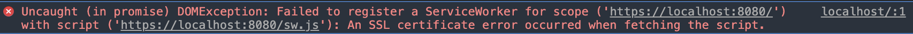
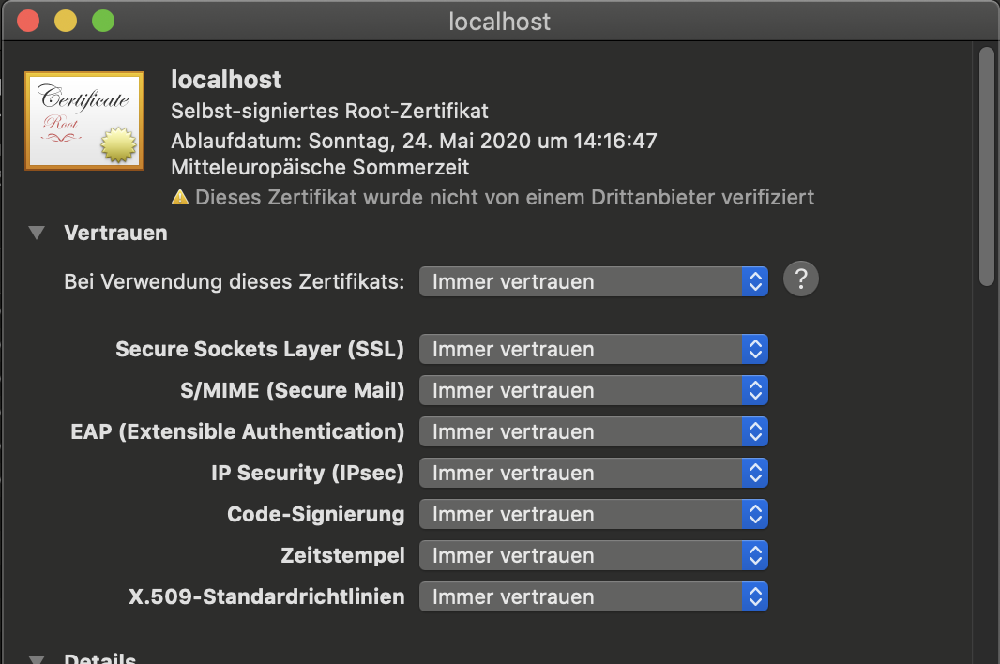

When you want to test PWA features like push notifications or handle caching within your development environment on your local machine you may encounter the following error message.



This is a safety mechanism of the browser which prevents registering the service worker on unsafe connections like HTTP and warns you when you use a self-signed certificate.

Many modern toolchains like [create react app,](https://reactjs.org/docs/create-a-new-react-app.html) [nexts.js,](https://nextjs.org/) [vue cli](https://cli.vuejs.org/) and [angular clis](https://cli.angular.io/) allow you to host and develop your application on HTTPS locally and provide you with a self-signed certificate.

e.g [CRA](https://create-react-app.dev/docs/using-https-in-development/)

```bash
$ set HTTPS=true&&npm start
```

This often simplifies the hosting part but often does not help you with the above issue since the certificates are not trusted by the browsers.

There are several ways to resolve this issue.

1. Open Chrome or Firefox such that it pretends certain domains are secure. For example, using Chrome on windows or mac, you can launch it using the following commands:

   ```bash
   #!/bin/bash
   # replace https://localhost:3000 with your port
   # on windows
   chrome.exe --user-data-dir=/tmp/foo --ignore-certificate-errors \
      --unsafely-treat-insecure-origin-as-secure=https://localhost:3000
   # on mac
   /Applications/Google\ Chrome.app/Contents/MacOS/Google\ Chrome \
      --user-data-dir=/tmp/foo --ignore-certificate-errors --unsafely-treat-insecure-origin-as-secure=https://localhost:3000
   ```

2. Another solution is to use and trust a self-signed certificate. Usually, those certificates are generated automatically by the modern development tools but you still have to trust those certificates. To overcome the problems relating to local dev on OSX you can do the following:

   - Create your certificate and serve it up
   - Navigate to the HTTPS URL e.g https://localhost:3000
   - Click on the not safe button in the URL bar or open dev tools > security > view certificate

   

   - drag the certificate icon to the desktop and double click on it, this will open up keychain access.

   

   - drag the certificate icon to log-in, open up log-in and double click on the certificate (it should be named with the dev domain or similar) open up the trust dropdown and select always trust. Go back to your app close the window and re-open with https, you should now have 'faux' https for your dev domain.

     

That's it now you can go to your app served locally and your Service Worker gets registered properly and you can deep dive into developing and debugging features.
